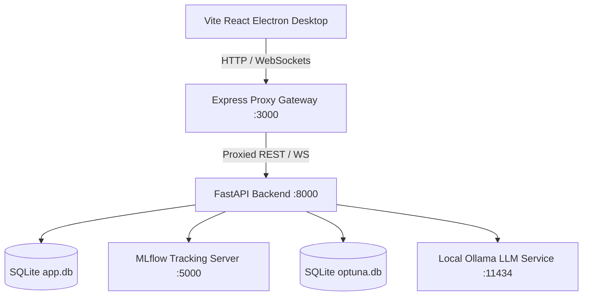

# TriVerse AI - Platform Technical Reference

This document provides a detailed technical reference for the TriVerse AI monorepo architecture, serving as a developer manual for deploying, debugging, and extending the platform.

---

## 1. System Architecture

TriVerse AI follows a local-first service architecture with three major vertical layers:

### Key Ports & Services
* **Vite React & Electron UI**: Serves user interactions on `http://localhost:3000`.
* **Express Proxy Gateway**: Handles auth checks, WebSocket upgrading, and proxies static visual assets.
* **FastAPI Backend**: Orchestrates inference endpoints and database models on `http://localhost:8000`.
* **MLflow Server**: Telemetry and experiment metric logs on `http://localhost:5000`.

---

## 2. Machine Learning Pipeline Mappings

The platform automates the ML lifecycle across three domains:

### Task 1: Credit Scoring
* **Dataset**: Give Me Some Credit (150,000 rows, 10 features) & Statlog German Credit.
* **Feature Engineering**: Imputation of missing monthly income, scaling via standard deviation normalization, and class-imbalance correction.
* **Models**: Logistic Regression, Decision Tree, Random Forest, CatBoost, Multi-Layer Perceptron (MLP).
* **Telemetry**: Stores metric curves, ROC curves, and parameters to MLflow.

### Task 2: Cardiovascular Disease Prediction
* **Dataset**: UCI Heart Disease, Breast Cancer Wisconsin, Pima Indians Diabetes.
* **Methodology**: Standard scaling, hyperparameter tuning with Optuna, and SHAP explainability.
* **Models**: Support Vector Classifier (SVC), Random Forest, XGBoost, CatBoost, MLP.

### Task 3: Handwritten Digit Recognition
* **Dataset**: MNIST Digits (60,000 train, 10,000 test) & EMNIST Balanced.
* **Models**: Custom CNN (Keras) and ResNet18 (PyTorch).
* **Pipeline**: Decodes incoming base64 drawing canvas images, rescales to 28x28 grayscale, normalizes to `[0, 1]`, and runs forward propagation.

---

## 3. Database Schema

The SQLite database (`codealpha.db`) stores configuration, audit tables, and experiment tracking details:

1. **`users`**: Platform user credentials, API keys, and joined dates.
2. **`experiments`**: Experiment metadata, including MLflow runs and training status (Pending, Running, Completed, Failed).
3. **`pipeline_statuses`**: Step-by-step progress tracking for ML pipelines (Data Ingestion -> Validation -> Feature Engineering -> Model Training).
4. **`experiment_metrics`**: Evaluation logs (Accuracy, Precision, Recall, F1-Score, Inference Time).
5. **`model_registry`**: Registered models promoted to Staging/Production.
6. **`optuna_trial_records`**: Bayesian hyperparameter search records.
